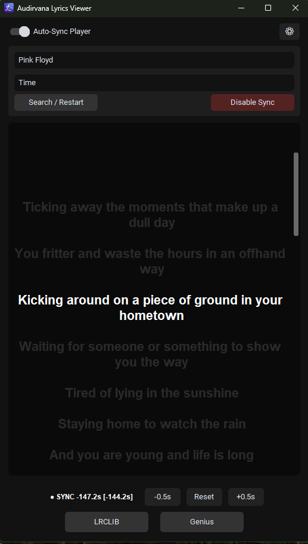

# Audirvana Lyrics Viewer (Synced)

**This app was vibe coded and I'm not a dev.**

A minimalist, high-fidelity lyrics companion for **Audirvana (Windows)**. Since Audirvana does not natively support Windows Media Controls (SMTC), this app uses a "Best Guess" sync engine by polling your **Last.fm** "Now Playing" status and matching it with **LRCLIB** and **Genius** databases.



## ✨ Features

* **Karaoke Mode:** Smoothly glides the active lyric line to the vertical center of the screen with a high-contrast "glowing" effect.
* **Dual Providers:** Prioritizes **LRCLIB** for perfectly timed `.lrc` data, with **Genius** as a fallback for obscure tracks.
* **Click-to-Sync:** Is the timing off? Simply click the lyric line that *should* be playing, and the app instantly snaps the internal clock to that position.
* **Manual Nudging:** Precision controls (`-0.5s` / `+0.5s`) located right above the provider buttons to account for Last.fm API latency in real-time.
* **Smart Sanitizer:** Automatically strips audiophile metadata (e.g., `(2015 Remaster)`, `[DSD64]`, `[PCM]`, `feat.`) for higher search accuracy.
* **Scroll-Lock:** Manual scrolling pauses the auto-centering for 3 seconds, allowing you to browse the song without the UI fighting you.
* **Static Mode:** Toggle sync off to shrink the font and browse lyrics like a traditional document.
* **Center Justification:** Lyrics are perfectly centered for a professional, distraction-free aesthetic.

## 🚀 Getting Started

### 1. Requirements
* A **Last.fm** account (with scrobbling enabled within Audirvana).
* **API Keys:** You will need a Last.fm API key/secret and a Genius Access Token (available for free at their respective developer portals).

### 2. Setup
1. Run `lyrics.exe`.
2. Click the **⚙ (Gear)** icon to open settings.
3. Enter your Last.fm Username, API Key, and Secret.
4. Set your **Default Sync Offset** (suggested: `-3.0` to account for the standard Last.fm delay).
5. Click **Save & Reload**.

### 3. Usage
The app will automatically detect your music as long as it is being scrobbled to Last.fm.
* **Auto-Sync Switch:** Toggle this to pause/resume tracking your player (useful for manual searches).
* **Disable/Enable Sync:** Switches between the large-font Karaoke view and the smaller-font Static Reading view.
* **Nudge Buttons:** Fine-tune the timing on the fly if the Last.fm API is lagging.
* **Clicking Lyrics:** Changes the mouse to a hand cursor; clicking any line recalibrates the timer to that specific line immediately.

## 🛠 Compilation (For Developers)

If you are building from source, use **PyInstaller** to create the standalone executable. Ensure you have your `icon.ico` in the root folder:

```bash
pyinstaller --noconsole --onefile --icon=icon.ico --add-data "icon.ico;." lyrics.pyw